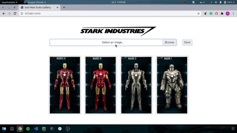

# Iron Man Suits Gallery 

[](https://github.com/olmaneuh/iron-man-suits-gallery/issues)
[](https://github.com/olmaneuh/iron-man-suits-gallery/blob/master/LICENSE)

A simple [Flask](https://flask.palletsprojects.com/en/1.1.x/) project that shows how to upload images, create a thumbnail, read files from a project directory, 
and display a gallery.




### Prerequisites
```
sudo apt-get update
sudo apt-get install python3 python3-dev python3-venv
```

_For more information about how to install Python 3  and Virtual Environments check the following links:_ 
* https://www.python.org/downloads/
* https://docs.python.org/3/tutorial/venv.html


### Setup and Getting Started
1. Clone the repository ``` git clone ... ```
2. Create and enable a virtual environment 
    ```
    cd iron-man-suits-gallery
    python3 -m venv venv
    source venv/bin/activate
    ```
3. Run ```pip install -r requirements.txt``` to install project dependencies 
4. Run the project ``` flask run ```


## Author
**Olman Ureña** is a lifelong student, highly motivated and passionate about AI/ML, new tech advances, build and assemble things, triathlon, music, and food.

* [LinkedIn](https://www.linkedin.com/in/olmaneuh/)
* [Medium](https://medium.com/@olmaneuh)
* [YouTube](https://www.youtube.com/channel/UCd15EHZwrwWub_8V2fXqOjg)


## License
This project is licensed under the Apache License v2.0 - see the [LICENSE.md](LICENSE.md) file for details
